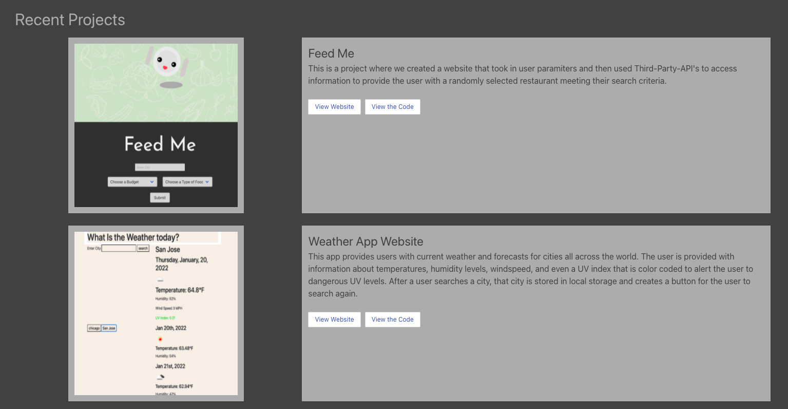
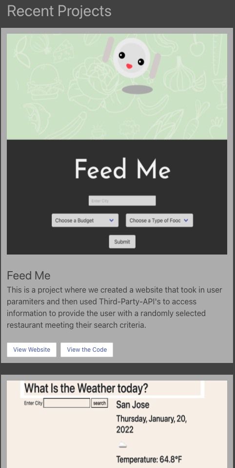

# firstPortfolio

This first portfolio site is a live site presenting a clean view of my recent projects, the deployed links, reference to the code, and information about the project. It is responsive and uses Bulma CSS Framework to style it. 

## Features
Here are some screenshots of the way the site is responsive. 

This is the top of the page for mobile...

This is part of my project section for wide screens...

And those projects on mobil screens. 

## Getting Started
 
 This is a live site, that can be reached at https://lauragupta.github.io/firstPortfolio/

## Built With

* [HTML](https://developer.mozilla.org/en-US/docs/Web/HTML)
* [Bulma CSS framework](https://bulma.io/)

## Deployed Link

* [See The Live Site](https://lauragupta.github.io/firstPortfolio/)

## Authors

* **Laura Gupta** 

- [Link to Portfolio Site](https://lauragupta.github.io/firstPortfolio/)
- [Link to Github](https://github.com/lauragupta?tab=repositories)
- [Link to LinkedIn](https://www.linkedin.com/in/laura-gupta-5a277158/)

## License
MIT License

Copyright (c) [2022] [Laura Gupta]

Permission is hereby granted, free of charge, to any person obtaining a copy of this software and associated documentation files (the "Software"), to deal in the Software without restriction, including without limitation the rights to use, copy, modify, merge, publish, distribute, sublicense, and/or sell copies of the Software, and to permit persons to whom the Software is furnished to do so, subject to the following conditions:

The above copyright notice and this permission notice shall be included in all copies or substantial portions of the Software.

THE SOFTWARE IS PROVIDED "AS IS", WITHOUT WARRANTY OF ANY KIND, EXPRESS OR IMPLIED, INCLUDING BUT NOT LIMITED TO THE WARRANTIES OF MERCHANTABILITY, FITNESS FOR A PARTICULAR PURPOSE AND NONINFRINGEMENT. IN NO EVENT SHALL THE AUTHORS OR COPYRIGHT HOLDERS BE LIABLE FOR ANY CLAIM, DAMAGES OR OTHER LIABILITY, WHETHER IN AN ACTION OF CONTRACT, TORT OR OTHERWISE, ARISING FROM, OUT OF OR IN CONNECTION WITH THE SOFTWARE OR THE USE OR OTHER DEALINGS IN THE SOFTWARE.

## Acknowledgments

* Thanks so much to all the information out there on the web! Especially the documentation at Bulma! 

* https://bulma.io/
